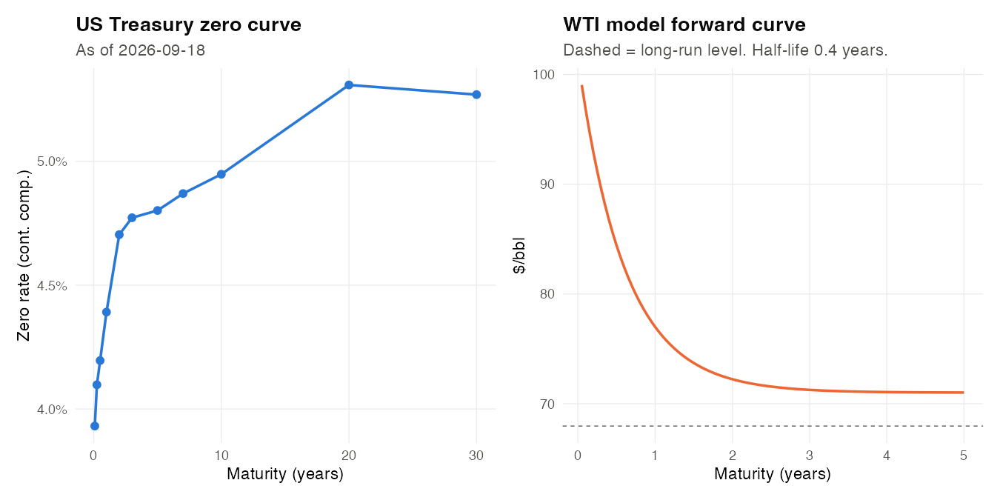
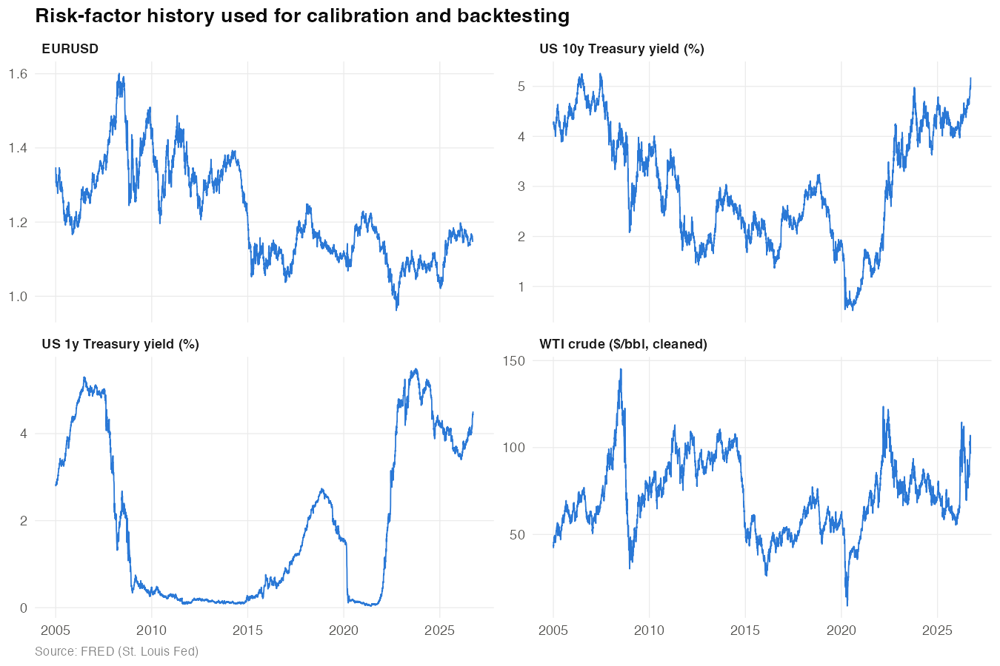
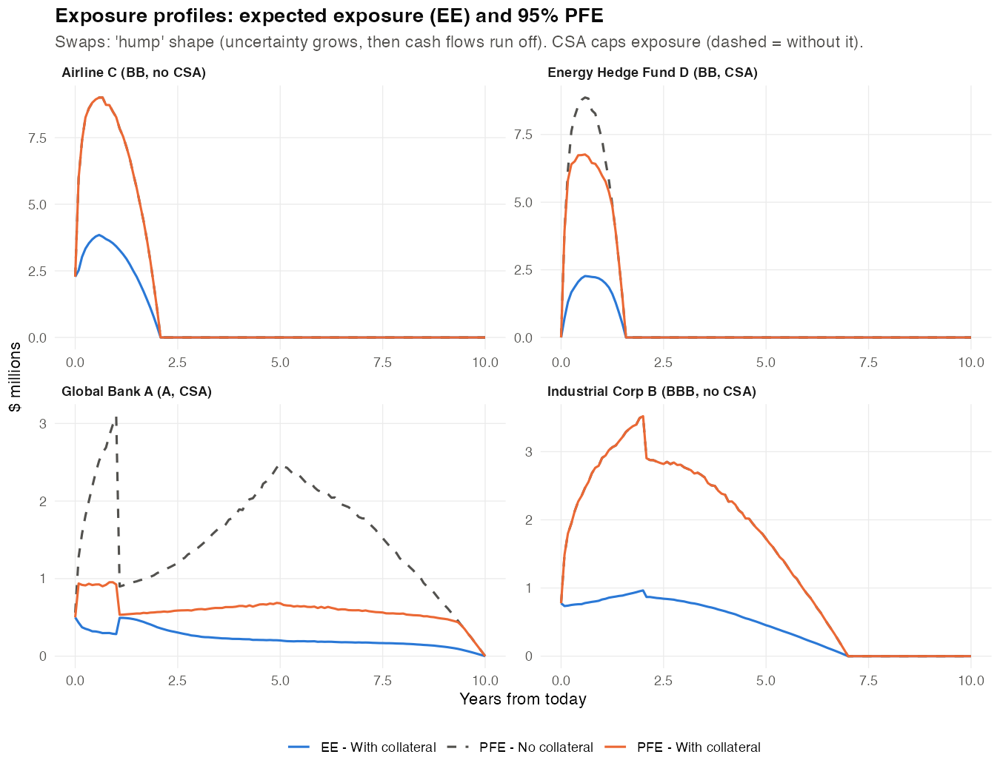
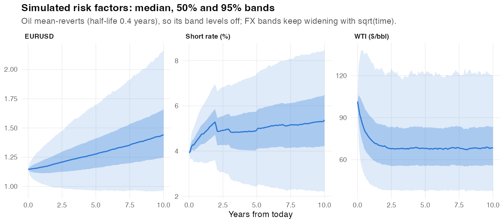
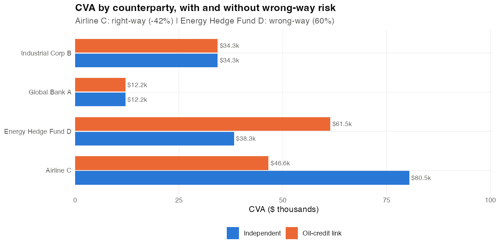
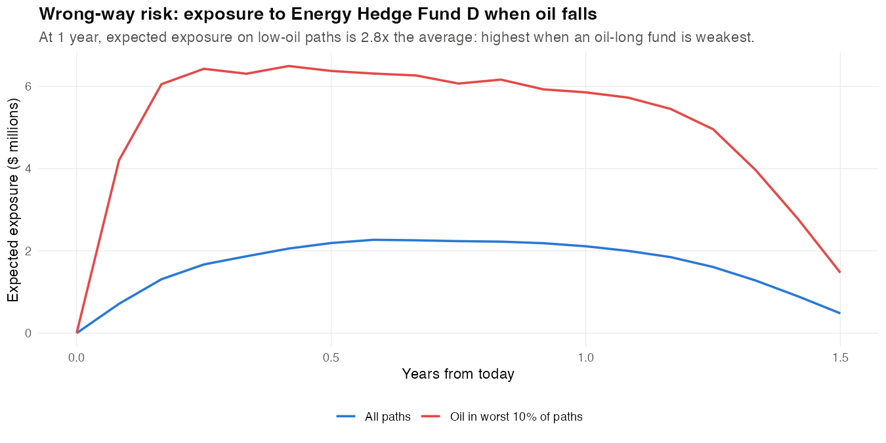
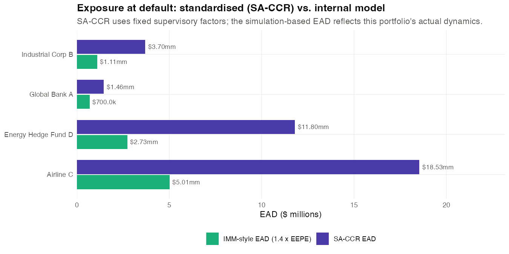
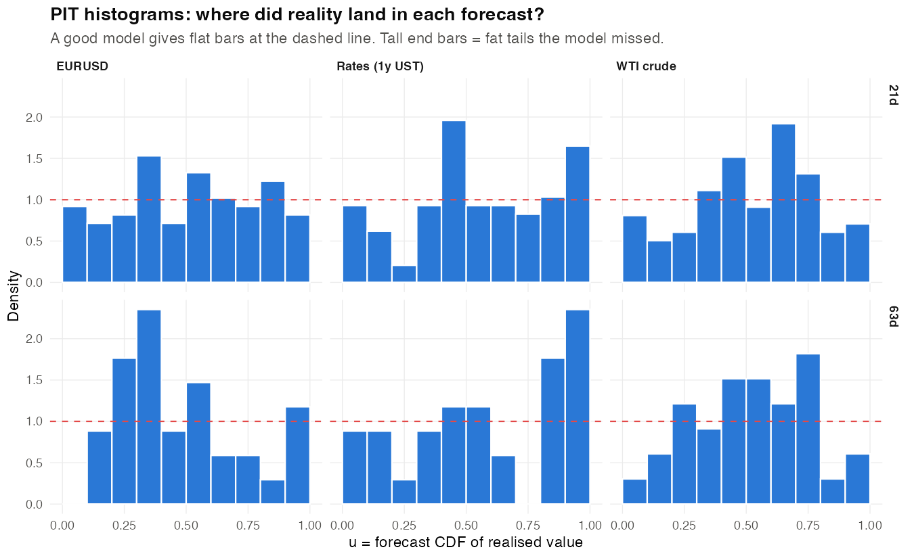
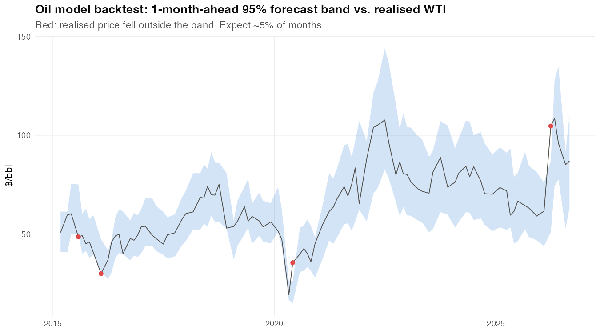
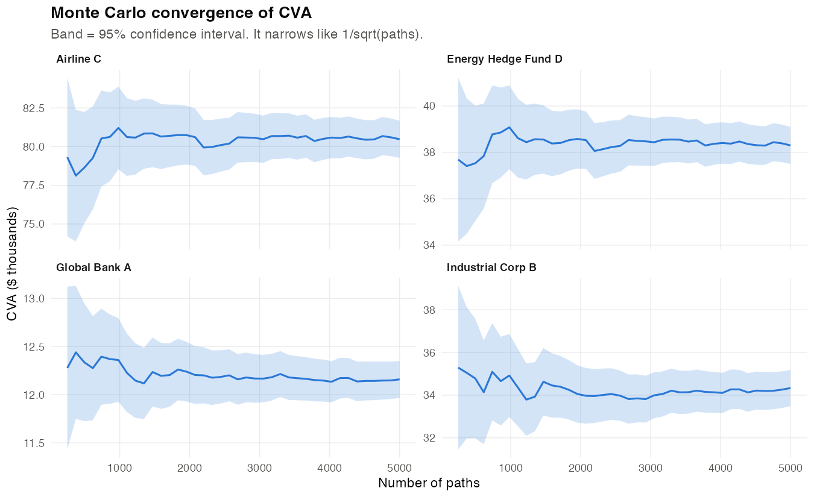

# Counterparty Credit Risk Summary

*Valuation date 2026-09-18. Generated by `counterparty-credit-risk/07_report.R`. Data: FRED. 5,000 paths, monthly grid.*

## Key observations

- **Book:** 7 trades with 4 counterparties, net MTM $1.91mm. Largest peak PFE (95%) is Airline C at $9.01mm, reached after 0.7 years.
- **Collateral:** for Global Bank A and Energy Hedge Fund D, the CSA changes peak PFE from $3.09mm / $8.87mm (no CSA) to $953.3k / $6.76mm. Thresholds and MTAs limit how much it helps.
- **CVA:** total $165.3k. The largest charge is Airline C ($80.5k), driven by BB credit and uncollateralised exposure.
- **Wrong-way risk:** linking credit to oil moves Fund D's CVA by 60% (wrong-way) and Airline C's by -42% (right-way). Same trade direction, opposite credit link, opposite result.
- **EAD:** SA-CCR totals $35.49mm versus $9.55mm from the simulation (1.4 x EEPE). SA-CCR is more conservative here.
- **Capital:** IRB default-risk RWA $23.78mm plus BA-CVA RWA $25.29mm = $49.07mm total counterparty RWA.
- **Backtest:** rates 21d: tails too thin (underestimates risk); rates 63d: tails too thin (underestimates risk). The usual fix is fatter-tailed shocks or regime-dependent volatility.
- **Validation:** all at-market trades reprice to ~0; 8 of 8 martingale checks pass; CVA Monte Carlo error is within 2% of the estimate for every counterparty.

## 1. Trade book

|Trade |Counterparty        |Description                                 |Strike  |MTM      |DV01    |
|:-----|:-------------------|:-------------------------------------------|:-------|:--------|:-------|
|T1    |Global Bank A       |5y payer swap (bank pays fixed)             |4.601%  |$550.0k  |$22.3k  |
|T2    |Global Bank A       |10y receiver swap (bank receives fixed)     |5.085%  |$234.9k  |-$24.1k |
|T3    |Global Bank A       |1y EUR forward, bank buys EUR               |1.1800  |-$223.6k |$2.3k   |
|T4    |Industrial Corp B   |7y swap: corporate hedges floating debt     |5.315%  |$940.4k  |-$24.3k |
|T5    |Industrial Corp B   |2y EUR forward: importer buys EUR from bank |1.1861  |-$163.6k |-$3.2k  |
|T6    |Airline C           |2y jet-fuel proxy hedge: airline pays fixed |83.5701 |$2.28mm  |-$0.5k  |
|T7    |Energy Hedge Fund D |18m swap: fund is long oil, bank short      |79.3068 |-$1.71mm |-$0.1k  |

## 2. Market data and model calibration

|Parameter                        |Value    |Source              |
|:--------------------------------|:--------|:-------------------|
|Hull-White mean reversion a      |0.05     |assumption (config) |
|Hull-White sigma (abs. rate vol) |0.006506 |1y UST, last 3y     |
|EURUSD volatility                |0.06725  |last 3y             |
|WTI mean reversion kappa         |1.574    |AR(1), last 10y     |
|WTI half-life (years)            |0.4403   |log(2)/kappa        |
|WTI long-run level ($/bbl)       |67.97    |exp(alpha)          |
|WTI volatility                   |0.525    |AR(1), last 10y     |
|EUR rate (ECB deposit)           |0.025    |FRED ECBDFR         |
|EURUSD spot                      |1.146    |FRED DEXUSEU        |
|WTI spot ($/bbl)                 |101.4    |FRED DCOILWTICO     |

## 3. Exposure

|Counterparty        |Rating |CSA |MTM      |Peak EE |Peak PFE |Peak PFE (no CSA) |EEPE    |
|:-------------------|:------|:---|:--------|:-------|:--------|:-----------------|:-------|
|Global Bank A       |A      |Yes |$561.3k  |$500.0k |$953.3k  |$3.09mm           |$500.0k |
|Industrial Corp B   |BBB    |No  |$776.9k  |$964.5k |$3.52mm  |$3.52mm           |$789.3k |
|Airline C           |BB     |No  |$2.28mm  |$3.85mm |$9.01mm  |$9.01mm           |$3.58mm |
|Energy Hedge Fund D |BB     |Yes |-$1.71mm |$2.27mm |$6.76mm  |$8.87mm           |$1.95mm |

**Stressed current exposure** (MTM after instant shocks):

|Counterparty        |Base     |Rates +100bp |Rates -100bp |EURUSD -10% |Oil -30% |Oil +30% |Combined: rates -100bp, oil -30%, EUR -10% |
|:-------------------|:--------|:------------|:------------|:-----------|:--------|:--------|:------------------------------------------|
|Global Bank A       |$561.3k  |$667.7k      |$565.9k      |-$1.67mm    |$561.3k  |$561.3k  |-$1.67mm                                   |
|Industrial Corp B   |$776.9k  |-$1.90mm     |$3.62mm      |$2.41mm     |$776.9k  |$776.9k  |$5.26mm                                    |
|Airline C           |$2.28mm  |$2.23mm      |$2.33mm      |$2.28mm     |$6.93mm  |-$1.73mm |$7.00mm                                    |
|Energy Hedge Fund D |-$1.71mm |-$1.71mm     |-$1.70mm     |-$1.71mm    |$5.39mm  |-$7.86mm |$5.43mm                                    |

## 4. CVA and wrong-way risk

|Counterparty        | Spread (bp)|CVA    |CS01  |CVA with oil link |WWR              |
|:-------------------|-----------:|:------|:-----|:-----------------|:----------------|
|Global Bank A       |          65|$12.2k |$0.2k |$12.2k            |No link modelled |
|Industrial Corp B   |          94|$34.3k |$0.4k |$34.3k            |No link modelled |
|Airline C           |         155|$80.5k |$0.5k |$46.6k            |Right-way        |
|Energy Hedge Fund D |         155|$38.3k |$0.2k |$61.5k            |Wrong-way        |

## 5. Regulatory exposure and capital (illustrative)

|Counterparty        |RC      |PFE add-on | Multiplier|SA-CCR EAD |IMM-style EAD |IRB PD |IRB RWA  |
|:-------------------|:-------|:----------|----------:|:----------|:-------------|:------|:--------|
|Global Bank A       |$500.0k |$541.6k    |       1.00|$1.46mm    |$700.0k       |0.05%  |$667.9k  |
|Industrial Corp B   |$776.9k |$1.87mm    |       1.00|$3.70mm    |$1.11mm       |0.15%  |$1.93mm  |
|Airline C           |$2.28mm |$10.96mm   |       1.00|$18.53mm   |$5.01mm       |0.60%  |$11.44mm |
|Energy Hedge Fund D |$5.25mm |$3.18mm    |       0.81|$11.80mm   |$2.73mm       |0.60%  |$9.74mm  |

|Measure                      |Amount   |
|:----------------------------|:--------|
|Total CVA                    |$165.3k  |
|Total SA-CCR EAD             |$35.49mm |
|Total IMM-style EAD          |$9.55mm  |
|IRB default-risk RWA         |$23.78mm |
|BA-CVA capital               |$2.02mm  |
|BA-CVA RWA                   |$25.29mm |
|Total CCR RWA (IRB + BA-CVA) |$49.07mm |

## 6. Backtesting and validation

**Risk-factor PIT backtest** (non-overlapping forecasts, rolling out-of-sample calibration):

|Factor |Horizon |  N| Outside 95%| Expected| Coverage p| KS p|Verdict                              |
|:------|:-------|--:|-----------:|--------:|----------:|----:|:------------------------------------|
|fx     |21d     | 98|           4|      4.9|       1.00| 0.52|Passes                               |
|fx     |63d     | 34|           2|      1.7|       0.69| 0.26|Passes                               |
|oil    |21d     | 99|           4|      5.0|       1.00| 0.12|Passes                               |
|oil    |63d     | 33|           2|      1.7|       0.68| 0.48|Passes                               |
|rates  |21d     | 97|          14|      4.9|       0.00| 0.04|Tails too thin (underestimates risk) |
|rates  |63d     | 34|           6|      1.7|       0.01| 0.06|Tails too thin (underestimates risk) |

**Martingale tests** (simulation must reproduce today's prices):

|Test              | t (yrs)| Model| Market| Error (bp)|Pass |
|:-----------------|-------:|-----:|------:|----------:|:----|
|Zero-coupon bond  |       1|  0.96|   0.96|      -0.79|Yes  |
|Discounted EURUSD |       1|  1.12|   1.12|     -12.47|Yes  |
|Zero-coupon bond  |       2|  0.91|   0.91|      -1.17|Yes  |
|Discounted EURUSD |       2|  1.09|   1.09|      -4.60|Yes  |
|Zero-coupon bond  |       5|  0.79|   0.79|       2.39|Yes  |
|Discounted EURUSD |       5|  1.02|   1.01|      44.66|Yes  |
|Zero-coupon bond  |      10|  0.61|   0.61|       8.42|Yes  |
|Discounted EURUSD |      10|  0.89|   0.89|      19.24|Yes  |

## Regulatory notes

- **SA-CCR** (Basel CRE52) is the standardised method for derivative EAD: `EAD = 1.4 x (RC + multiplier x AddOn)`. It replaced the older Current Exposure Method; US advanced-approaches banks must use it and other US banks may elect it.
- **IMM** (internal model method) lets approved banks use simulated EEPE instead: `EAD = alpha x EEPE`, with alpha = 1.4 (or bank-estimated, floored at 1.2). IMM approval requires ongoing backtesting like section 6.
- **CVA capital** (Basel MAR50): banks use BA-CVA (shown here) or SA-CVA (sensitivity-based, built on FRTB machinery). The old internal-model CVA approach was removed.
- **IRB** (Basel CRE31) turns EAD into default-risk capital with the Vasicek one-factor formula. Basel III final rules restrict large corporates and financials to Foundation IRB with supervisory LGDs.
- **Accounting:** CVA (and DVA) are fair-value adjustments under IFRS 13 / ASC 820, so they hit P&L. xVA desks hedge CVA with CDS and market hedges.
- **Timing:** EU applies the final Basel package via CRR3 (FRTB/CVA pieces phased to 2027); UK Basel 3.1 applies from 1 Jan 2027; US agencies re-proposed Basel III endgame in March 2026. Check current status before quoting dates.

## Limitations

- One curve (Treasuries) for discounting and forwarding; production uses SOFR OIS curves and a separate EUR curve.
- Hull-White mean reversion is fixed; production calibrates it to swaption volatilities.
- Oil is modelled on spot with a one-factor model; production fits the full NYMEX futures curve (two-factor Schwartz-Smith or similar).
- Collateral uses a simplified VM model (no initial margin, no disputes, threshold + MTA combined).
- The WWR link is a stylised hazard-rate model with an assumed strength (`WWR_B` in config).
- Bond-index spreads stand in for CDS; they include liquidity premia.
- The oil forward curve is the model's own (historical long-run level), not NYMEX futures, so the at-market pricing check proves internal consistency only.
- AR(1) estimates of mean reversion are biased upward in finite samples, so oil's long-horizon volatility may be understated.
- Folding the MTA into the threshold leaves a permanent residual exposure of about the MTA on margined sets (conservative).
- The PIT backtest uses zero drift, so it tests the volatility assumptions rather than the risk-neutral drifts used for CVA.
