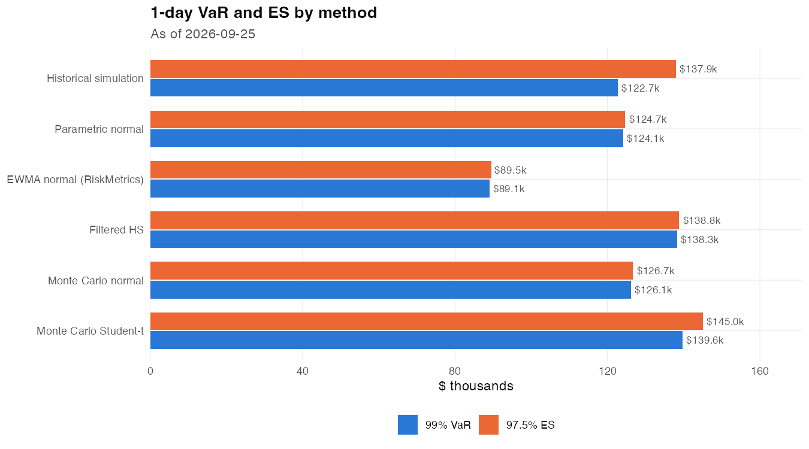
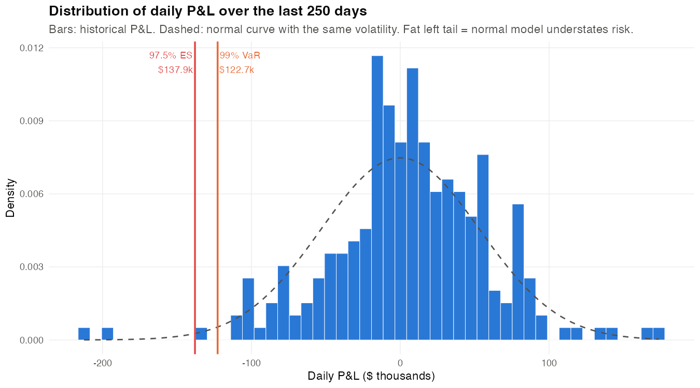
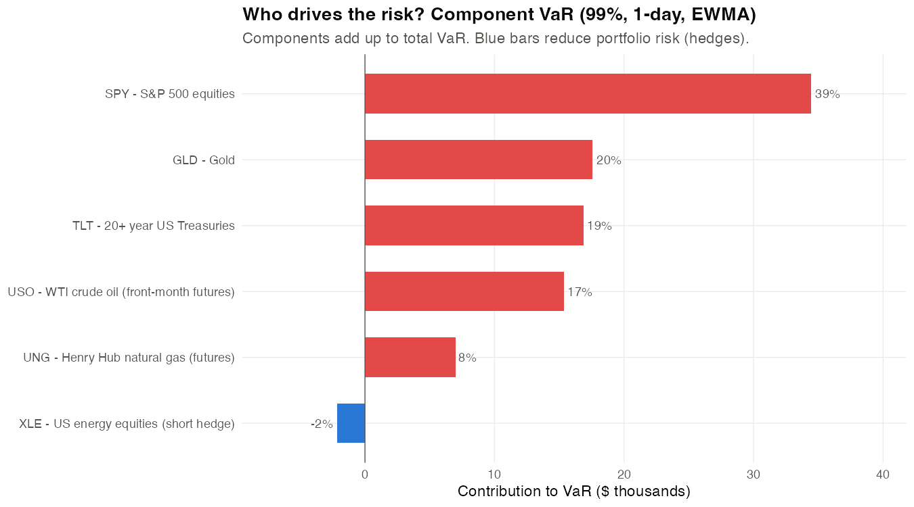
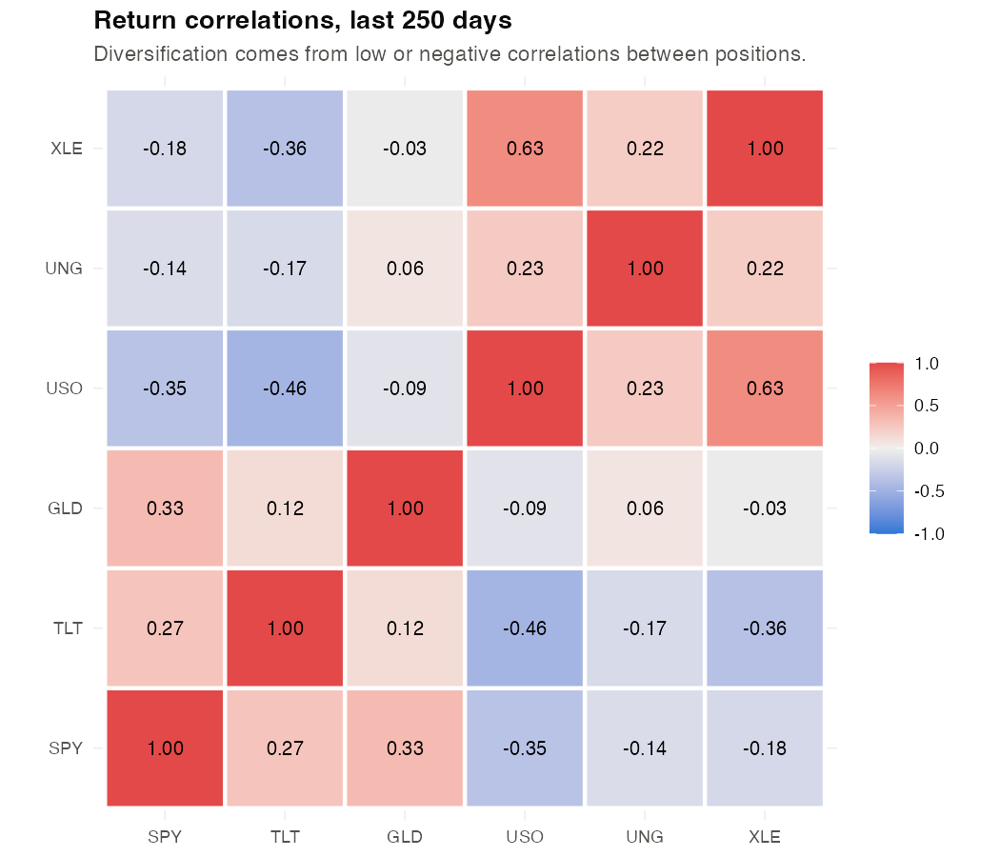
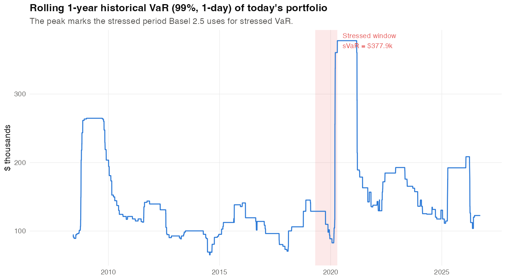
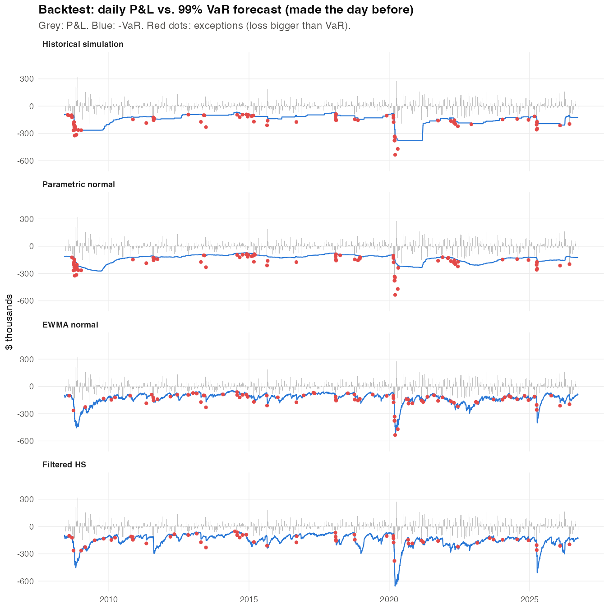
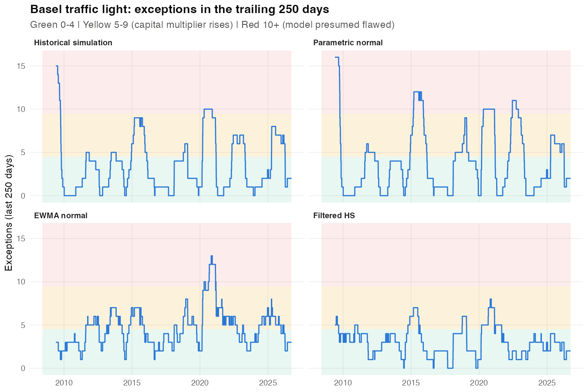
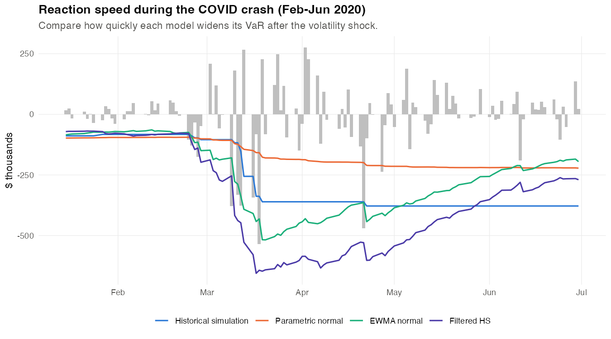
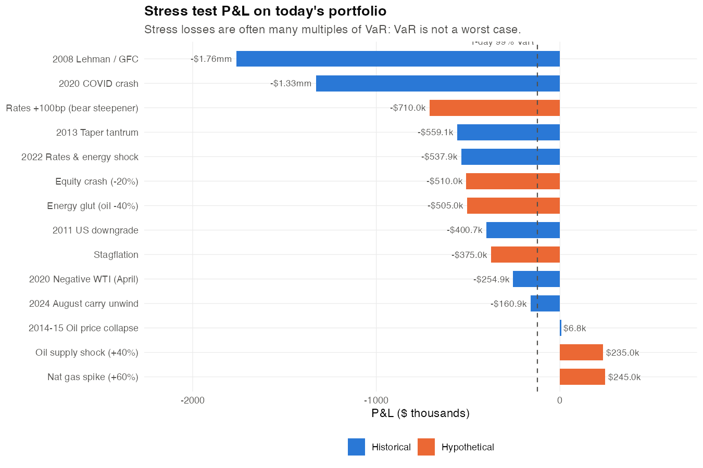
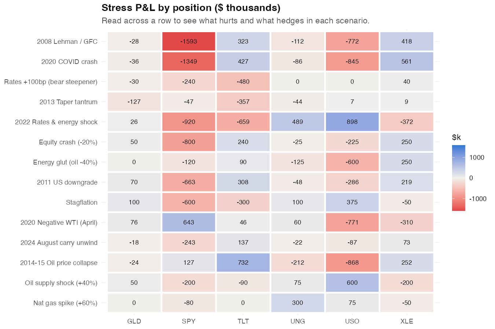

# Market Risk Summary

*As of 2026-09-25. Generated by `market-risk/06_report.R`. Data: Yahoo Finance, FRED.*

## Portfolio

|Ticker |Asset class |Description                         |Position |
|:------|:-----------|:-----------------------------------|:--------|
|SPY    |Equity      |S&P 500 equities                    |$4.00mm  |
|TLT    |Rates       |20+ year US Treasuries              |$3.00mm  |
|GLD    |Commodity   |Gold                                |$1.00mm  |
|USO    |Commodity   |WTI crude oil (front-month futures) |$1.50mm  |
|UNG    |Commodity   |Henry Hub natural gas (futures)     |$500.0k  |
|XLE    |Equity      |US energy equities (short hedge)    |-$1.00mm |

## Key observations

- **Headline:** 1-day 99% historical VaR is **$122.7k** (1.12% of gross exposure); 97.5% ES is **$137.9k**.
- **Volatility regime:** EWMA VaR ($89.1k) is below historical VaR, so recent markets are calmer than the past-year average. HS still carries older, larger moves in its window.
- **Tail shape:** historical ES / VaR = 1.12. Under a normal distribution the ratio is ~1.00 at these confidence levels, so the realised tail is fatter than normal.
- **Risk drivers:** SPY contributes the most risk (39% of VaR). XLE is the best hedge (-2% of VaR). Diversification saves $221.2k versus adding up standalone VaRs.
- **Stressed VaR:** the worst 1-year window is 2019-04-25 to 2020-04-21, giving sVaR of $377.9k (3.1x today's VaR).
- **Backtest:** Historical simulation: 72 exceptions vs 46 expected (underestimates risk (too many exceptions)). Parametric normal: 81 exceptions vs 46 expected (underestimates risk (too many exceptions)). EWMA normal: 83 exceptions vs 46 expected (underestimates risk (too many exceptions)). Filtered HS: 57 exceptions vs 46 expected (right count, but exceptions cluster).
- **Stress:** worst scenario is *2008 Lehman / GFC* at -$1.76mm (14.4x VaR). A -30.3% move in the S&P 500 (with beta-linked moves elsewhere) would lose $1.00mm.

## 1. VaR and ES by method

|Method                    |99% VaR (1d) |97.5% ES (1d) |99% VaR (10d) | ES / VaR|
|:-------------------------|:------------|:-------------|:-------------|--------:|
|Historical simulation     |$122.7k      |$137.9k       |$388.0k       |     1.12|
|Parametric normal         |$124.1k      |$124.7k       |$392.3k       |     1.00|
|EWMA normal (RiskMetrics) |$89.1k       |$89.5k        |$281.8k       |     1.00|
|Filtered HS               |$138.3k      |$138.8k       |$437.2k       |     1.00|
|Monte Carlo normal        |$126.1k      |$126.7k       |$398.8k       |     1.00|
|Monte Carlo Student-t     |$139.6k      |$145.0k       |$441.6k       |     1.04|

## 2. Where the risk comes from

|Ticker |Position |Standalone VaR |Component VaR |% of total |
|:------|:--------|:--------------|:-------------|:----------|
|SPY    |$4.00mm  |$63.7k         |$34.5k        |38.7%      |
|TLT    |$3.00mm  |$50.2k         |$16.9k        |18.9%      |
|GLD    |$1.00mm  |$31.9k         |$17.6k        |19.7%      |
|USO    |$1.50mm  |$103.6k        |$15.3k        |17.2%      |
|UNG    |$500.0k  |$30.4k         |$7.0k         |7.9%       |
|XLE    |-$1.00mm |$30.5k         |-$2.2k        |-2.4%      |

## 3. Regulatory capital (illustrative)

|Measure                                     |Amount  |
|:-------------------------------------------|:-------|
|Basel 2.5: VaR + stressed VaR capital       |$4.75mm |
|FRTB-style liquidity-adjusted ES (97.5%)    |$636.9k |
|of which: 10-day ES, all factors            |$436.2k |
|of which: 10-day ES, 20-day-horizon factors |$464.1k |

## 4. Backtesting

Out-of-sample, 4610 trading days (2008-05-30 to 2026-09-25). Each forecast uses only the prior 250 days.

|Model                 | Exceptions| Expected| Kupiec p| Christoffersen p| ES Z2| Last 250d|Zone  |FRTB desk pass |% days in red |Verdict                                   |
|:---------------------|----------:|--------:|--------:|----------------:|-----:|---------:|:-----|:--------------|:-------------|:-----------------------------------------|
|Historical simulation |         72|     46.1|     0.00|             0.00| -0.32|         2|Green |Yes            |5.5%          |Underestimates risk (too many exceptions) |
|Parametric normal     |         81|     46.1|     0.00|             0.00| -0.54|         2|Green |Yes            |13.8%         |Underestimates risk (too many exceptions) |
|EWMA normal           |         83|     46.1|     0.00|             0.00| -0.47|         3|Green |Yes            |3.8%          |Underestimates risk (too many exceptions) |
|Filtered HS           |         57|     46.1|     0.12|             0.01| -0.07|         2|Green |Yes            |0.0%          |Right count, but exceptions cluster       |

*p-values below 0.05 reject the model at 5% significance. Z2 below -0.70 flags ES as too low.*

## 5. Stress testing

|Scenario                      |Type         |P&L      | x VaR|
|:-----------------------------|:------------|:--------|-----:|
|2008 Lehman / GFC             |Historical   |-$1.76mm |  14.4|
|2020 COVID crash              |Historical   |-$1.33mm |  10.8|
|Rates +100bp (bear steepener) |Hypothetical |-$710.0k |   5.8|
|2013 Taper tantrum            |Historical   |-$559.1k |   4.6|
|2022 Rates & energy shock     |Historical   |-$537.9k |   4.4|
|Equity crash (-20%)           |Hypothetical |-$510.0k |   4.2|
|Energy glut (oil -40%)        |Hypothetical |-$505.0k |   4.1|
|2011 US downgrade             |Historical   |-$400.7k |   3.3|
|Stagflation                   |Hypothetical |-$375.0k |   3.1|
|2020 Negative WTI (April)     |Historical   |-$254.9k |   2.1|
|2024 August carry unwind      |Historical   |-$160.9k |   1.3|
|2014-15 Oil price collapse    |Historical   |$6.8k    |  -0.1|
|Oil supply shock (+40%)       |Hypothetical |$235.0k  |  -1.9|
|Nat gas spike (+60%)          |Hypothetical |$245.0k  |  -2.0|

## Regulatory notes

- **Basel 2.5 (US Market Risk Rule, in force today):** 10-day 99% VaR plus stressed VaR, each times a multiplier of 3 (up to 4 after poor backtests). Backtesting uses the traffic light on 250 days of 99% VaR exceptions.
- **FRTB (Fundamental Review of the Trading Book):** replaces VaR with 97.5% Expected Shortfall scaled to liquidity horizons (10 to 120 days), calibrated to a stressed period, and approved desk by desk. Desks must pass backtesting (at most 12 exceptions at 99% and 30 at 97.5% in 250 days) and a P&L attribution test comparing risk-model P&L to front-office P&L.
- **Timing:** FRTB capital applies in the EU from 1 Jan 2027; the UK applies Basel 3.1 from 1 Jan 2027 with FRTB internal models from 1 Jan 2028; US agencies re-proposed their Basel III endgame rules (including FRTB) in March 2026. Check current status before quoting dates.
- **Model risk (SR 11-7 in the US):** every model needs independent validation: conceptual soundness, ongoing monitoring (this backtest) and outcomes analysis.

## Limitations

- ETFs proxy risk factors; a real book maps positions to curves, spreads and vol surfaces.
- Positions are linear, so there are no option Greeks (gamma, vega) in this book.
- 10-day figures use square-root-of-time scaling, which assumes independent daily returns.
- USO and UNG hold futures, so their returns include roll yield, not just spot moves.
